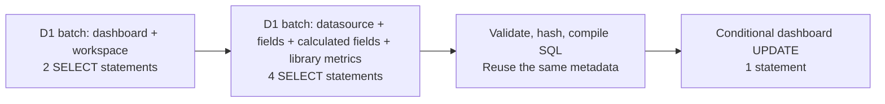

# Canvas and query performance after request optimizations

New widgets now show a pending placeholder before metadata or creation requests complete.
Saved widgets keep their running queries across layout saves and dashboard refreshes.
In the branch preview, median time from drop to first data fell from 5.06 to 1.62 seconds
for DuckDB and from 0.95 to 0.53 seconds for ClickHouse. Every measured final drop made
one query with no cancellation. DuckDB's four-widget throughput remains slow.

## Drop measurements

Times are milliseconds from the drop handler to DOM insertion, rather than compositor paint.
The placeholder represents pending creation; the persisted widget and its data arrive later.

| Measurement | DuckDB before | DuckDB after | ClickHouse before | ClickHouse after |
| --- | ---: | ---: | ---: | ---: |
| Visible canvas feedback | 735 | 10, pending placeholder | 614 | 7, pending placeholder |
| Persisted widget inserted | 735 | 313 | 614 | 308 |
| First data shown | 5,059 | 1,619 | 952 | 529 |
| Query requests per drop | 3 | 1 | 3 | 1 |
| Queries canceled before completion | 2 | 0 | 1 | 0 |

The baseline contains two DuckDB drops and one ClickHouse drop. The final version contains
five drops per backend. ClickHouse's baseline first result appeared before the unnecessary
refresh queries; its last successful query completed about 1.83 seconds after dropping.
Three final text drops showed a placeholder in a median 7 ms and the saved text in 159 ms,
with no analytics queries. The baseline text drop took 187 ms.

Across these cases, ordinary builder refreshes fell from a median 497 ms to 122 ms.
They send `includeSharing: false`, while initial loads and sharing mutations still load
sharing information. The API defaults to including sharing for existing callers.

## SQL waterfall

For an existing workspace and an admin user, query-widget creation changed from 14 SQL
statements in 14 D1 binding calls across 8 sequential stages to 7 SQL statements in 3 calls.
The authorization batch runs before metadata access. Non-admin users still require a grant
read before accessing the datasource. Conditional saves still reject concurrent edits.

Five baseline creation traces had a median handler time of 307 ms. Thirty subsequent
creation samples had a median handler time of 139 ms, ranging from 125 to 204 ms.
Five of those requests had sampled D1 traces, all showing two batches followed by the
conditional update. Two sampled final query-widget creations confirm the same 3-call,
7-statement waterfall. Text creation needs only the authorization batch and update.

Actual SQL time was already small. Its median sum fell from 3.95 ms to 1.79 ms in the
five traced samples for each version. Removing network waits accounts for most of the
handler improvement. Initial datasource descriptions and query execution now also fetch
the datasource and its metadata in one batch.

Smart Placement is enabled only for branch previews. Sampled spans still show Worker
execution in Düsseldorf and D1 in Marseille. These measurements do not establish a
placement-related improvement.

## Four widgets requested together

The original benchmark's four saved widgets were requested concurrently, including a
previous-period comparison that submits two SQL executions. Each cell is the median of
five dashboard loads. All 80 retained widget responses were cache misses, and normalized
rows and comparison rows matched across engines and repeated loads.

| Backend and dataset | Baseline | After | After range |
| --- | ---: | ---: | ---: |
| DuckDB, 100k rows | 3,839 ms | 5,033 ms | 2,937 to 6,957 ms |
| ClickHouse, 100k rows | 322 ms | 288 ms | 263 to 728 ms |
| DuckDB, 1m rows | 5,955 ms | 6,739 ms | 6,419 to 7,219 ms |
| ClickHouse, 1m rows | 576 ms | 488 ms | 456 to 542 ms |

This repeat does not demonstrate an improvement in DuckDB throughput. The container still
serializes SQL executions and reads remote Parquet for each execution. The next experiment
should measure bounded, authorized local Parquet reuse for immutable datasource versions
before changing queue concurrency. The query executor and its queue are unchanged here.

## Method and limits

Only the isolated branch preview and existing synthetic benchmark data were used:
`https://t3code-benchmark-uncached-query-performance-yresonance.rundown.workers.dev`.
All four datasource policies were independently checked as `disabled`. Application result
caching was disabled; OS, database page, and object-storage caches were not flushed.

Baseline browser measurements were recorded through the T3 collaborative browser. That
browser disconnected during the follow-up, so retained follow-up measurements used
agent-browser's headless Chrome at 1280×800. Both dispatch the same HTML drag events
through the real catalog and grid handlers; they do not reproduce physical pointer motion.
Local browser tests separately exercise a real pointer move and gated API responses.
Small samples, different browser harnesses, and infrastructure variation limit percentage
claims. Request counts and sampled SQL waterfalls provide more direct evidence of the fixes.

The first-pass creation samples and traces were captured on `1705394`. Final drop measurements
were captured on deployed `234b8cf`, which additionally batches initial metadata descriptions
and preserves explicit empty filter selections. One long browser CLI evaluation lost its
response; its results were discarded and the retained 1m benchmark was repeated one load
at a time. Single-drop measurements were repeated after that benchmark completed.

Validation: the full repository check passed with 327 unit tests; 79 Worker integration
tests passed. The local full UI run passed 63 tests with one existing skip. Four focused
browser tests passed on the final changes, including pending creation failure and clearing
a default filter. The three original regressions fail on the previous implementation.
All CI checks passed on the final functional commit, including engine parity and authenticated
browser tests.

[Raw samples and parameterized D1 trace evidence](2026-10-05-canvas-performance.json)
include timestamps and request/trace IDs for inspection. They contain no credentials or
request headers. The [original uncached benchmark](2026-10-05-uncached-queries.md) contains
baseline methodology and engine timings.
